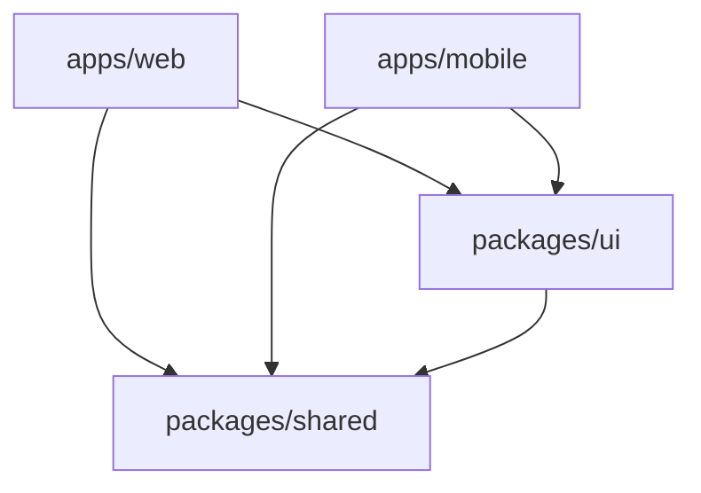

# The-Gist

An AI-powered news app that provides Instagram Stories-style news summaries. Built as a cross-platform monorepo with shared components for web (Next.js) and mobile (React Native + Expo).

## 🌟 Features

- **Instagram Stories Interface**: Swipe through news stories with auto-advance timers and smooth progress bars
- **AI-Powered Summaries**: Get concise, intelligent summaries of news articles
- **Cross-Platform**: Available on both web and mobile platforms with shared UI components
- **Interactive Elements**: Like, follow, and share news stories
- **Responsive Design**: Optimized for all screen sizes
- **Card-Based Layout**: Beautiful, modern card design with overlay text and backgrounds
- **Dark Theme**: Sleek dark interface for comfortable reading
- **Monorepo Architecture**: Shared code, types, and components across platforms

## 🏗️ Monorepo Architecture

```
The-Gist/
├── apps/                           # Platform-specific applications
│   ├── web/                       # Next.js web application
│   │   ├── src/
│   │   │   ├── app/               # Next.js App Router
│   │   │   │   ├── page.tsx       # Home page with news grid
│   │   │   │   ├── layout.tsx     # Root layout
│   │   │   │   └── globals.css    # Global styles
│   │   │   └── components/        # Web-specific components
│   │   │       ├── NewsCard.tsx   # News card component
│   │   │       ├── StoryViewer.tsx # Instagram Stories viewer
│   │   │       └── ClientOnly.tsx  # Hydration wrapper
│   │   ├── next.config.ts         # Next.js configuration
│   │   ├── tailwind.config.ts     # Tailwind CSS config
│   │   └── package.json
│   └── mobile/                    # Expo React Native application
│       ├── components/            # Mobile-specific components
│       │   ├── NewsCard.tsx       # Mobile news card
│       │   └── StoryViewer.tsx    # Mobile Stories viewer
│       ├── types/                 # TypeScript declarations
│       │   └── react-native.d.ts  # React Native type fixes
│       ├── assets/                # App icons and splash screens
│       ├── App.tsx                # Main app component
│       ├── index.js               # Expo entry point
│       ├── app.json               # Expo configuration
│       ├── metro.config.js        # Metro bundler config
│       └── package.json
├── packages/                       # Shared packages
│   ├── shared/                    # Shared types, constants, and utilities
│   │   └── src/
│   │       ├── types/             # TypeScript interfaces
│   │       ├── constants/         # Mock data and design tokens
│   │       └── index.ts           # Package exports
│   ├── ui/                        # Shared UI components and patterns
│   │   └── src/
│   │       ├── components/        # Shared component utilities
│   │       ├── patterns.ts        # Design patterns and layouts
│   │       ├── utils.ts           # Story controller and utilities
│   │       ├── types.ts           # UI-specific types
│   │       └── index.ts           # Package exports
│   ├── config/                    # Shared configuration
│   └── assets/                    # Shared assets
├── package.json                   # Root package.json with workspaces
├── turbo.json                     # Turborepo configuration
└── README.md                      # This file
```

### Package Structure

#### `apps/web` - Next.js Web Application
- **Framework**: Next.js 15.4.4 with Turbopack
- **Styling**: Tailwind CSS
- **Language**: TypeScript
- **Port**: http://localhost:3000

#### `apps/mobile` - Expo React Native Application  
- **Framework**: Expo SDK 53+
- **Language**: TypeScript
- **React**: 19.0.0 (aligned with web)
- **Port**: http://localhost:8081

#### `packages/shared` - Shared Types & Logic
- TypeScript interfaces and types
- Mock news data and constants
- Business logic and utilities
- Cross-platform data models

#### `packages/ui` - Shared UI Components
- Cross-platform component patterns
- Shared styling constants and themes
- Story controller and interaction logic
- Design patterns and layouts

## 🚀 Getting Started

### Prerequisites

- **Node.js 18.18.0+** (for Next.js compatibility)
- **npm** (comes with Node.js)
- **Expo Go app** on your mobile device (for testing mobile app)

### Installation

1. **Clone the repository**
   ```bash
   git clone https://github.com/oliviahe0111/The-Gist.git
   cd The-Gist
   ```

2. **Install all dependencies**
   ```bash
   npm install
   ```
   This installs dependencies for all packages and apps using npm workspaces.

## 🖥️ Running the Applications

### Option 1: Run Both Apps Simultaneously

```bash
# Start both web and mobile development servers
npm run dev
```

This will start:
- **Web app**: http://localhost:3001
- **Mobile app**: http://localhost:8081 (with QR code for Expo Go)

### Option 2: Run Apps Individually

#### Web Application Only
```bash
# Run web app only
npm run web:dev

# Or navigate to web directory
cd apps/web
npm run dev
```
- **URL**: http://localhost:3001
- **Features**: Full desktop experience with responsive design

#### Mobile Application Only
```bash
# Run mobile app only
npm run mobile:dev

# Or navigate to mobile directory
cd apps/mobile
npx expo start
```
- **URL**: http://localhost:8081
- **QR Code**: Scan with Expo Go app on your phone
- **Simulators**: Press `i` for iOS simulator, `a` for Android

### Testing on Mobile Device

1. **Install Expo Go** on your phone:
   - [iOS App Store](https://apps.apple.com/app/expo-go/id982107779)
   - [Google Play Store](https://play.google.com/store/apps/details?id=host.exp.exponent)

2. **Start the mobile development server**:
   ```bash
   npm run mobile:dev
   ```

3. **Scan the QR code** that appears in your terminal with:
   - **iOS**: Camera app or Expo Go app
   - **Android**: Expo Go app

## 🎯 Usage

1. **Browse News**: View news stories in a grid layout on the home page
2. **Story Mode**: Tap any news card to enter Instagram Stories-style viewer
3. **Navigation**: 
   - **Web**: Click left/right sides of story, use arrow keys, or ESC to close
   - **Mobile**: Tap left/right sides, hold to pause auto-advance
   - Stories auto-advance every 5 seconds
4. **Interactions**:
   - ❤️ **Like**: Tap heart icon (turns red when liked)
   - 👥 **Follow**: Tap follow button (toggles following state)
   - 📤 **Share**: Tap share icon (logs to console)
   - ⋯ **Menu**: Access additional options

## 🛠️ Development

### Building for Production

```bash
# Build all packages and apps
npm run build

# Build specific apps
npm run web:build    # Web production build
npm run mobile:build # Mobile production build
```

### Code Structure

```bash
# Shared types and constants
packages/shared/src/types/news.ts          # NewsItem, StoryViewer interfaces
packages/shared/src/constants/index.ts     # MOCK_NEWS_DATA, design tokens

# Shared UI patterns
packages/ui/src/patterns.ts                # Layout patterns, formatting
packages/ui/src/utils.ts                   # StoryController class
packages/ui/src/components/                # Cross-platform utilities

# Platform implementations
apps/web/src/components/NewsCard.tsx       # Web news card with Tailwind
apps/mobile/components/NewsCard.tsx        # Mobile news card with StyleSheet
```

### Package Scripts

```bash
# Root level commands
npm run dev          # Start all apps in development
npm run build        # Build all packages and apps
npm run lint         # Lint all code
npm run clean        # Clean all build artifacts

# Individual app commands
npm run web:dev      # Web development server
npm run web:build    # Web production build
npm run mobile:dev   # Mobile Expo development server
npm run mobile:build # Mobile production build
```

## 🎨 Shared Design System

### Colors
- **Primary**: `#000000` (Black)
- **Secondary**: `#1a1a1a` (Dark Gray)
- **Accent**: `#ff3040` (Red for likes)
- **Text**: White with opacity variants

### Layout Constants
- **Card Max Width**: 350px
- **Story Duration**: 5 seconds per story
- **Progress Animation**: Smooth 60fps using React Native Animated
- **Border Radius**: 16px for cards, 12px for overlays
- **Spacing**: 16px, 20px standard spacing

### Components
- **NewsCard**: Shared layout with platform-specific styling
- **StoryViewer**: Instagram Stories interface with progress bars
- **Progress Bars**: Smooth animated progress indicators
- **Interactive Controls**: Like, Follow, Share with state management

## 📁 Package Dependencies

The monorepo uses npm workspaces with the following dependency structure:



All apps import shared packages using:
```typescript
import { NewsItem, MOCK_NEWS_DATA } from '@the-gist/shared';
import { formatNewsCardContent } from '@the-gist/ui';
```

## 🔧 Technical Stack

### Frontend Frameworks
- **Web**: Next.js 15.4.4 with Turbopack and App Router
- **Mobile**: Expo SDK 53+ with React Native 0.79.5
- **Shared**: React 19.0.0 across all platforms

### Development Tools
- **Monorepo**: Turborepo for build orchestration and caching
- **Package Manager**: npm workspaces for dependency management
- **Language**: TypeScript with strict mode
- **Styling**: Tailwind CSS (web) + StyleSheet (mobile)

### Build System
- **Web**: Next.js build system with Turbopack
- **Mobile**: Metro bundler with workspace support
- **Shared**: TypeScript compilation with watch mode
- **Caching**: Turborepo handles dependency caching

## 🚨 Troubleshooting

### Common Issues

1. **"Invalid hook call" errors**:
   ```bash
   # Clear all caches and reinstall
   rm -rf node_modules package-lock.json
   npm install
   ```

2. **Metro bundler can't resolve shared packages**:
   ```bash
   # Clear Metro cache
   cd apps/mobile
   npx expo start --clear
   ```

3. **TypeScript errors in React Native components**:
   - The project includes type fixes in `apps/mobile/types/react-native.d.ts`
   - Components use `// @ts-nocheck` for React 19 compatibility

4. **Port conflicts**:
   - Web app runs on port 3001 (if 3000 is occupied)
   - Mobile app runs on port 8081 (default Expo port)

### Node.js Version
- **Required**: Node.js 18.18.0+ for optimal Next.js compatibility
- **Current**: The project is tested with Node.js 18.x and 20.x

## 📄 License

This project is licensed under the MIT License.

## 👨‍💻 Author

Created by [oliviahe0111](https://github.com/oliviahe0111)

---

## 🎯 Project Highlights

✅ **Cross-Platform Compatibility**: Single codebase with shared logic  
✅ **Instagram Stories Experience**: Full-featured story viewer with progress bars  
✅ **Type Safety**: End-to-end TypeScript with shared interfaces  
✅ **Performance**: Smooth 60fps animations using React Native Animated  
✅ **Developer Experience**: Hot reload, TypeScript compilation, and build caching  
✅ **Responsive Design**: Works seamlessly on desktop, mobile web, and native mobile  

*The Gist - Your AI-powered news companion* ✨
